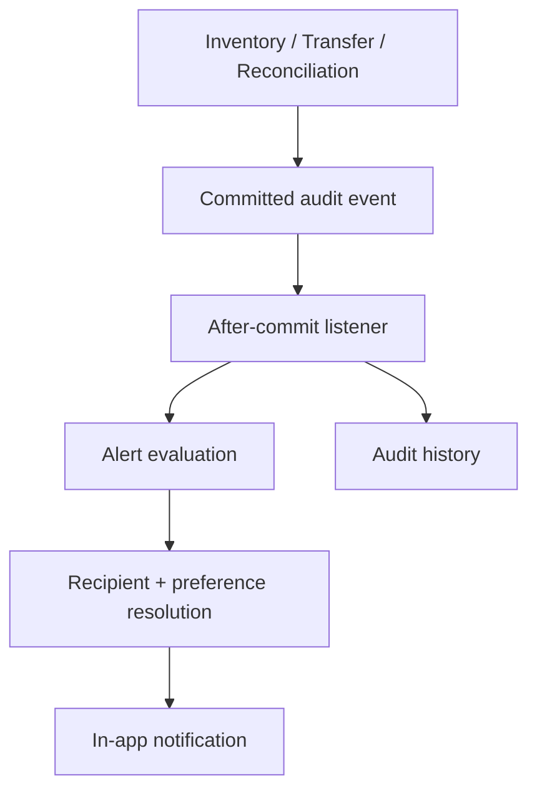

# Multi-Warehouse Inventory Control & Stock Reconciliation System — Backend

Project Lead: **Rohit Choudhary — 2400031478**

## Stack and setup

Java 17, Spring Boot 3.5, PostgreSQL, Flyway, Spring Security, JJWT and springdoc OpenAPI are used. Set these environment variables; do not commit real values or a `.env` file.

```text
DB_URL=jdbc:postgresql://localhost:5432/multi_warehouse_inventory_db
DB_USERNAME=inventory_app
DB_PASSWORD=your-secure-password
JWT_SECRET=a-random-secret-of-at-least-32-bytes
JWT_EXPIRATION=3600
JWT_ISSUER=inventory-command-center
FRONTEND_URL=http://localhost:5173
```

`JWT_EXPIRATION=3600` creates short-lived, one-hour access tokens. Generate a unique, high-entropy secret for each environment. The application refuses secrets under 32 bytes. Refresh tokens are intentionally out of scope: clients remove the bearer token on logout, tokens expire quickly, and every authenticated request reloads the user, status, roles and permissions from the database. This means deactivation and role changes take effect on the next request.

## Authentication API

`POST /api/v1/auth/login` accepts `{ "email": "...", "password": "..." }` and returns an `ApiResponse` containing an access token, `Bearer` token type, expiry seconds and a safe user profile. Supply it to protected calls as `Authorization: Bearer <token>`.

`GET /api/v1/auth/me` returns the current safe profile. `POST /api/v1/auth/logout` records the event and instructs the client to delete its token; it does not pretend to revoke a stateless JWT. Password hashes, passwords, and JWT secrets are never returned or logged.

Invalid credentials and missing/invalid/expired tokens return consistent `401` error bodies. Valid users without an authority receive `403`.

## Roles and permissions

System-defined roles are seeded by Flyway: `ADMIN`, `INVENTORY_MANAGER`, `WAREHOUSE_MANAGER`, `WAREHOUSE_OPERATOR`, `AUDITOR`, and `VIEWER`. Roles are not mutable through API; their permissions are seeded and exposed read-only through `GET /api/v1/roles`. Administrators can assign roles with `PATCH /api/v1/users/{id}/roles`.

Permissions are explicit database mappings, not role hierarchy. `ADMIN` has every permission; inventory managers manage inventory/products/transfers; warehouse managers manage their assigned warehouse operations; operators execute assigned warehouse operations; auditors can read audits/reconciliation; viewers have read-only operational access. User/role management requires `USER_*` and `ROLE_*` authorities. Product and warehouse reads require `PRODUCT_READ` and `WAREHOUSE_READ`.

`user_warehouses` is mapped on `User`. Part 5 must enforce its scope in every warehouse-specific mutation/query; this part supplies assigned warehouse data in the current-user profile and the normalized relationship.

## User management

All endpoints below require the named permission and never serialize JPA entities:

- `GET /api/v1/users?page=0&size=20&search=rohit&status=ACTIVE&role=ADMIN` (`USER_READ`)
- `GET /api/v1/users/{id}` (`USER_READ`)
- `POST /api/v1/users` (`USER_CREATE`)
- `PUT /api/v1/users/{id}` (`USER_UPDATE`)
- `PATCH /api/v1/users/{id}/status` and `DELETE /api/v1/users/{id}` (`USER_DEACTIVATE`; delete is a soft deactivation)
- `PATCH /api/v1/users/{id}/roles` (`ROLE_ASSIGN`)

New passwords need 10–100 characters containing upper-case, lower-case, a number and a special character, and are BCrypt-hashed before persistence. User creation, role assignments, status changes and login/logout produce `audit_logs` records without credentials/tokens.

## OpenAPI, Postman and testing

Swagger UI is at `/swagger-ui/index.html`; OpenAPI JSON is at `/v3/api-docs`. The Postman collection is `postman/Multi-Warehouse Inventory System.postman_collection.json`; it stores only `baseUrl`, `accessToken`, and `userId`, and captures the login token automatically.

Run `mvn clean test` from `backend`. Flyway applies `V1__initial_schema.sql` then `V2__seed_rbac_catalogue.sql`. Health remains public at `/api/v1/health` and `/actuator/health`.

## Master data

Warehouse, zone, category, supplier, and product endpoints are protected by explicit `WAREHOUSE_*` and `PRODUCT_*` permissions. Warehouse and product lists accept Spring pagination/sorting; warehouses support `search` and `status`, while products support `search`, `status`, `categoryId`, and `supplierId`. Flyway V3 provides non-sensitive demo warehouses, zones, categories, and suppliers only—no stock data or credentials.

## Part 5 handoff

Warehouse, product and category entities/repositories and protected list endpoints already exist. Part 5 must retain `ApiResponse`/`ErrorResponse`, DTO mapping, validation, request IDs, Flyway-forward-only migrations, and `@PreAuthorize` authorities. Add warehouse/product/category CRUD with `WAREHOUSE_*` and `PRODUCT_*`; enforce `user_warehouses` in the service layer for managers/operators; audit every mutation; and add pagination/validation/authorization tests. Do not weaken JWT, expose password hashes, modify V1, or break health and existing list endpoints.

## Alerts, notifications and audit (Part 9)

V4 adds alert deduplication and notification preferences. Inventory and transfer audit writes publish Spring events after commit; listeners evaluate low/out/over-stock alerts and create warehouse-scoped in-app notifications. Notification APIs derive the recipient from JWT and support pagination, unread counts, read state, preferences, and critical-alert preference bypass. Audit history is append-only and read through `GET /api/v1/audit` with action/entity filters.


