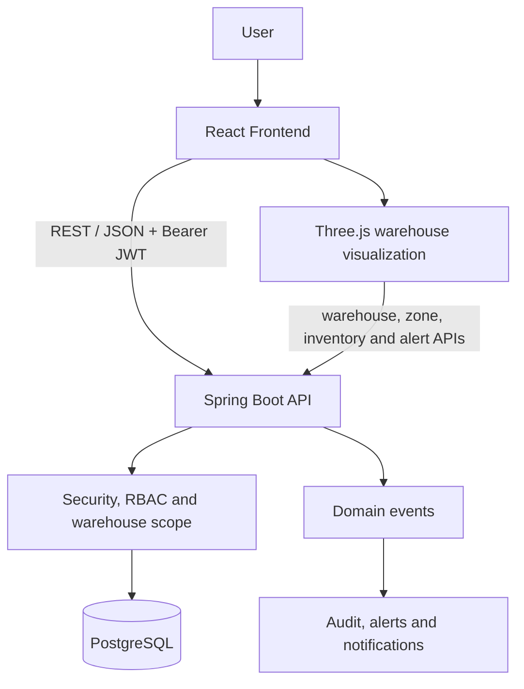
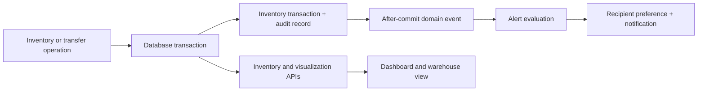

# System Architecture

The application is a two-process system: a React/Vite client and a Spring Boot REST API backed by PostgreSQL. Flyway owns schema changes; JPA uses `ddl-auto=validate` so the application never mutates the production schema implicitly.

## Module boundaries

- Authentication and authorization: JWT, BCrypt, Spring Security authorities and CORS.
- Master data: users, roles, warehouses, zones, categories, suppliers and products.
- Operations: inventory movements, immutable inventory transactions and stock transfers.
- Operational intelligence: alerts, in-app notifications and append-only audit history.
- Presentation: authenticated React routes and the warehouse 3D/2D visualization.

## Data flow

## Deployment

The frontend is built to static files with Vite and must be served by a static web server. The backend is packaged as a Spring Boot JAR and reads database, JWT and frontend-origin settings from environment variables. PostgreSQL must be reachable before the backend starts so Flyway can validate and migrate the schema.
